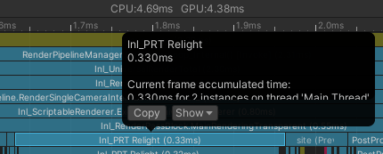
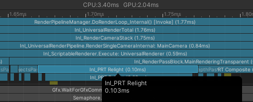

# Unity PRTGI

Precomputed Radiance Transfer Global Illumination for Unity URP.

Reading online: https://zhuanlan.zhihu.com/p/571673961

## Version

URP 2022.3.17f1

URP 14.0.9

## Features

### Editor Baking

1. **Create Probe Volume**: Add a `ProbeVolume` component to a GameObject in your scene
2. **Configure Grid Settings**:
   - **Probe Size**: Set X, Y, Z dimensions for the 3D probe grid (e.g., 8x4x8)
   - **Probe Grid Size**: Distance between probes (e.g., 2.0 units)
   - **Bake Resolution**: Choose 256x256 or 512x512 for cubemap quality
3. **Bake Data**: Click "Bake Data" button in the inspector to:
   - Generate probes in 3D grid formation
   - Capture G-buffer data (world position, normals, albedo) from each probe location
   - Store precomputed radiance transfer data for real-time global illumination
4. **Data Storage**: Baked data is saved in `ProbeVolumeData` asset for runtime use

> **Note**: Baking may take time depending on probe count and resolution. Progress is shown in the editor.

### Debugging

The system provides two-level debugging modes to help understand and debug PRT global illumination effects:

#### ProbeVolume Debug Modes
- **None**: No debug visualization
- **ProbeGrid**: Shows probe grid layout for visualizing probe distribution in 3D space
- **ProbeRadiance**: Shows probe irradiance spheres, visualizing light information captured by each probe

#### Individual Probe Debug Modes
When ProbeRadiance mode is selected, click on probes in the scene for detailed debugging:

- **IrradianceSphere**: Shows irradiance sphere (default), sphere color reflects SH lighting coefficients
- **SphereDistribution**: Shows spherical sampling point distribution (yellow for surfaces, blue for sky)
- **SampleDirection**: Shows sampling ray directions from probe position to sample points
- **Surfel**: Shows surfels (surface elements) with green normals indicating surface orientation
- **SurfelRadiance**: Shows surfel radiance, color represents light intensity received by each surfel

> **Note**: Debug modes are only available in editor, debug visualization is automatically hidden at runtime.

### Multi Frame Relighting

Enable `Multi Frame Relight` in `ProbeVolume` to relight part of probes each frame to reduce per-frame cost.

#### With Full Relighting

#### Enable Multi Frame Relighting

